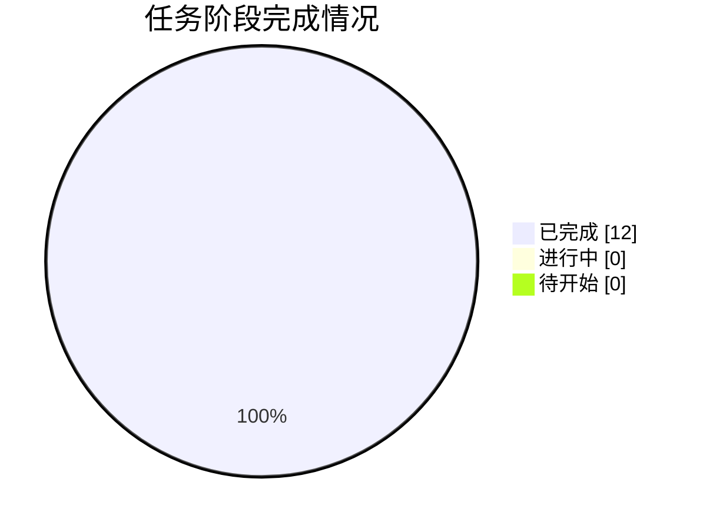

# 🚚 AAW · MathorCup 2025 赛道 B

**物流理赔风险识别及服务升级 —— 12-Agent 数模竞赛流水线**

   

---

## 📌 项目简介

本项目用一套 **A0–A11 共 12 个角色化 Agent** 的流水线体系求解 **2025 年第 15 届 MathorCup 数学建模挑战赛·大数据竞赛赛道 B**：基于 11167 条历史运单建立理赔风险标注模型（合理诉求 / 诉求偏高 / 严重超额），预测 2792 条待预测运单的实际赔付金额与风险标注，并完成竞赛论文。本仓库每小时自动同步一次项目进展，全部快照见 [reports/](reports/)。

**三问概览**：Q1 风险标注模型 · Q2 实际赔付金额回归预测（SMAPE/MAE/RMSE/WMAPE）· Q3 风险标注分类预测（含不均衡处理与双路线对比论述）

## 🎯 当前状态

| 指标 | 值 |
|---|---|
| 当前阶段 | **G6 提交包汇总（全部阶段完成）** |
| 总进度 | **100%**（12 完成 / 0 进行中 / 0 待开始） |
| 最近更新 | 2026-10-04 06:00 |

## 📋 阶段进度总览

| 阶段 | 内容 | 状态 | 产物 |
|---|---|---|---|
| **G0** | 工作区/数据勘察、台账建立 | ✅ 完成 | STATE.md、00_admin/* |
| **A1** | 题意拆解 | ✅ 完成 | paper/01_题意拆解.md |
| **A2** | 假设清单 | ✅ 完成 | paper/01b_假设清单.md |
| **A3** | 清洗/EDA/特征工程 | ✅ 完成 | code/eda_clean.py、output/eda/*、output/data/clean_*.csv |
| **A4** | Q1 标注规则设计 | ✅ 完成 | paper/02_问题1标注模型.md、output/tables/q1_*.csv|json |
| **A5** | Q2/Q3 算法规格 | ✅ 完成 | paper/03_算法规格.md |
| **A6** | 代码实现与结果产出 | ✅ 完成 | code/{q1_label,q2_reg,q3_clf,fill_result}.py、output/Result_提交.xlsx |
| **A7** | 结果与敏感性分析 | ✅ 完成 | code/q_sensitivity.py、paper/04_结果分析.md、output/tables/q*_sensitivity 等表 |
| **A8** | 可视化 | ✅ 完成 | code/plots.py、output/figures/fig1~fig11.png（300dpi，中文正常） |
| **A9** | 论文撰写 | ✅ 完成 | paper/论文.md（290 行） |
| **A10** | 摘要与全文润色 | ✅ 完成 | 摘要定稿、中英混杂修正 |
| **G6** | 提交包汇总 | ✅ 完成 | paper/论文.docx（106 段/9 表/8 图） |

## 🏆 成果展示

- [📄 论文与文档](deliverables/paper/) · [📈 图表](deliverables/figures/) · [📦 提交结果](deliverables/result/)
- 结果摘要：[deliverables/result/result_摘要.md](deliverables/result/result_摘要.md)（A6 完成后可用）

## 🗂 目录导航

| 路径 | 内容 |
|---|---|
| [PROGRESS.md](PROGRESS.md) | 进度台账：阶段明细、关键结论、同步时间线 |
| [reports/](reports/) | 每小时同步快照（含台账/看板/决策原文存档），最新见 [LATEST.md](reports/LATEST.md) |
| [docs/pipeline.md](docs/pipeline.md) | 12-Agent 流水线架构与门禁体系 |
| [docs/data-notes.md](docs/data-notes.md) | 数据事实与已识别数据坑 |
| [docs/decisions.md](docs/decisions.md) | 决策记录（随阶段追加） |
| [docs/task-board.md](docs/task-board.md) | 任务看板（A0 维护） |
| [docs/environment.md](docs/environment.md) | 环境与工具链、目录约定 |
| [deliverables/](deliverables/) | 成果镜像：代码 / 论文 / 图表 / 表格 / 提交结果 |
| [sync/](sync/) | 自动同步脚本（可复现同步过程） |

---

本仓库由 sync_to_github.py 每小时自动同步 · 数据源为工作区 STATE.md · 竞赛原始数据不入库

