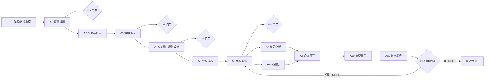

# 流水线架构：12-Agent 数模竞赛体系

> 本项目采用一套 12 个角色化 Agent（A0–A11）的流水线体系求解 2025 年第 15 届 MathorCup 数学建模挑战赛——大数据竞赛 **赛道 B：物流理赔风险识别及服务升级**。总控 Agent 按阶段调度各角色，产物落盘于本地工作区，并每小时同步至本仓库。

## 1. 总体流程

## 2. 角色分工（A0–A11）

| Agent | 角色 | 职责 | 主要产物 |
|---|---|---|---|
| **A0** | chief-orchestrator | 总控：任务拆解、调度、门禁检查、仲裁、进度台账维护 | `STATE.md`、任务看板、决策记录 |
| **A1** | problem-analyst | 审题：拆解三个问题的目标、约束与评价指标 | `paper/01_题意拆解.md` |
| **A2** | literature-assumption | 检索文献与领域知识，提出合理假设并注明依据 | `paper/01b_假设清单.md` |
| **A3** | data-engineer | 数据读取、清洗、缺失/异常处理、特征工程、统计描述 | `code/eda_clean.py`、`output/eda/*`、`output/data/*` |
| **A4** | model-designer | Q1 风险标注模型：定义变量、阈值规则与软约束验证 | `paper/02_问题1标注模型.md` |
| **A5** | algorithm-solver | Q2/Q3 算法规格：求解器选择、CV 方案、不均衡处理 | `paper/03_算法规格.md` |
| **A6** | implementation-coder | 代码实现与结果产出：回归/分类/结果填写 | `code/q1_label.py`、`q2_reg.py`、`q3_clf.py`、`output/Result_提交.xlsx` |
| **A7** | result-analyst | 结果、误差、敏感性与稳健性分析 | `paper/04_结果分析.md` |
| **A8** | visualization-designer | 论文级图表：统一风格、中文无乱码、300dpi | `output/figures/fig*.png` |
| **A9** | paper-writer | 按竞赛论文结构撰写正文 | `paper/论文.md` |
| **A10** | abstract-polisher | 摘要撰写与全文语言、格式、引用润色 | 摘要定稿 |
| **A11** | qa-reproducer | 独立只读质检：可复现性、一致性、合规性终审 | `code/qa_check.py`、`output/logs/qa_report.md` |

## 3. 门禁体系

| 门禁 | 阶段 | 通过标准 |
|---|---|---|
| G0 | 启动 | 工作区建立、数据勘察完成、台账建立 |
| G1 | A1 后 | 三问拆解完整、口径定义清晰 |
| G2 | A3 后 | 缺失/异常全说明、清洗后可复跑 |
| G3 | A4 后 | 满足软约束（严重超额 <3%、合理诉求 ≥85%）、规则可复现 |
| G4 | A6 后 | 运单号不变、类别取值合法、日志齐全 |
| G5 | A9 后 | 论文结构完整、含两处必答论述 |
| G6 | A11 后 | 0 ERROR 才终审通过，任一 ERROR 打回修复复检 |

## 4. 决策机制

- 所有跨阶段技术决策写入 **决策记录**（见 [decisions.md](decisions.md)），注明阶段、理由与影响范围。
- 台账文件 `STATE.md` 为唯一进度权威来源：上下文丢失后可据此完整恢复流水线。
- 参考往届仓库仅借鉴思路与图表组织方式，所有文字与代码重写为原创（学术诚信约束）。
