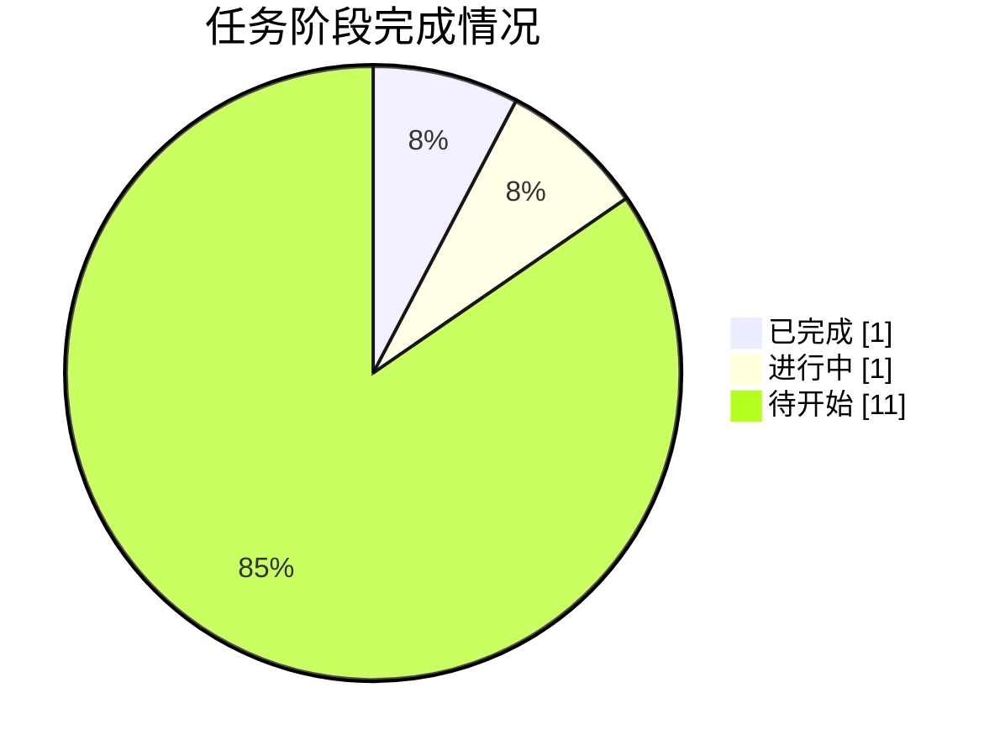

# 📸 同步快照 · 2026-10-04 02:01

> 由 `sync/sync_to_github.py` 自动生成 | 数据源：`agent_workspace/STATE.md`

## 本轮概要

| 指标 | 值 |
|---|---|
| 当前进度 | **12%** |
| 已完成阶段 | 1 |
| 进行中阶段 | 1 |
| 待开始阶段 | 11 |
| 当前阶段 | A1 题意拆解 |

### 本轮镜像的成果文件

- **代码**：0 个文件
- **论文与阶段文档**：0 个文件
- **图表**：0 个文件
- **结果表格**：0 个文件
- **日志与QA**：0 个文件
- **提交结果**：0 个文件

## 阶段状态表

| 阶段 | 内容 | 状态 | 产物 |
|---|---|---|---|
| **G0** | 工作区/数据勘察、台账建立 | ✅ 完成 | STATE.md、00_admin/* |
| **A1** | 题意拆解 | 🔄 进行中 | paper/01_题意拆解.md |
| **A2** | 文献与假设 | ⬜ 待开始 | paper/01b_假设清单.md |
| **A3** | 清洗/EDA/特征工程 | ⬜ 待开始 | code/eda_clean.py、output/eda/*、output/data/* |
| **A4** | Q1 标注规则设计 | ⬜ 待开始 | paper/02_问题1标注模型.md |
| **A5** | Q2/Q3 算法规格 | ⬜ 待开始 | paper/03_算法规格.md |
| **A6** | 代码实现与结果产出 | ⬜ 待开始 | code/*.py、output/tables/*、output/Result_提交.xlsx |
| **A7** | 结果与敏感性分析 | ⬜ 待开始 | paper/04_结果分析.md |
| **A8** | 可视化 | ⬜ 待开始 | output/figures/* |
| **A9** | 论文撰写 | ⬜ 待开始 | paper/论文.md |
| **A10** | 摘要润色 | ⬜ 待开始 | paper/论文.md |
| **A11** | 终审质检 | ⬜ 待开始 | code/qa_check.py、output/logs/qa_report.md |
| **G6** | 提交包汇总 | ⬜ 待开始 | output/Result_提交.xlsx、paper/论文.docx |



---

## 附：STATE.md 台账原文

```markdown
# STATE.md — 2025 MathorCup 大数据竞赛 B 赛道 流水线状态台账

> 维护人：A0 chief-orchestrator。每次调度前后更新，保证上下文丢失可恢复。
> 最后更新：G0 完成，A1 进行中。所有结论数字以实际运行为准，未运行前不预填。

## 1. 赛题与交付要求（摘要）
- 赛题：物流理赔风险识别及服务升级。三类风险标注：合理诉求 / 诉求偏高 / 严重超额。
- 索赔差额 = 实际赔付金额 − 索赔金额（通常为负；超额索赔额 = 索赔金额 − 实际赔付金额）。
- 软约束：严重超额占比 <3%，合理诉求 ≥85%；阈值应随实际赔付金额增大而增大；同类运单差额在相近实赔层内应密集。
- Q1 建立风险标注模型（附件1 标注结果）；Q2 预测附件2 实际赔付金额（SMAPE/MAE/RMSE/WMAPE+CV），填入 Result；Q3 预测附件2 风险标注填入同一 Result，须论述严重超额不均衡处理与"直接分类 vs 先回归后标注"优劣势。

## 2. 数据事实（已核验，G0）
- data/附件1.xlsx：11168 行×25 列；第 1 数据行为英文字段名行，真实样本 **11167**；含目标列"实际赔付金额"，无运单号。
- data/附件2.xlsx：2793 行×26 列；英文字段名行后真实样本 **2792**；含"运单号"(1..2792)，无实际赔付金额。
- data/Result.xlsx：2792 行×3 列（运单号/实际赔付金额/风险标注），运单号 1..2792 与附件2 行序一致，**严禁改动运单号**。
- 数据坑（待 A3 确认处理）：-1 为缺失标记（新旧程度/寄件是否内部等）；妥投到进线时长、配送超时时长存在疑似毫秒/秒混用的量纲异常（如 723606396）；万单理赔率存在负值；异常原因有 NaN。

## 3. 目录约定
- 00_admin/：task_board.md、progress.md、decisions.md、task_cards/
- code/：eda_clean.py、q1_label.py、q2_reg.py、q3_clf.py、fill_result.py、plots.py、qa_check.py、common.py
- output/：eda/、figures/、tables/、logs/、data/（清洗后数据集）、Result_提交.xlsx
- paper/：01_题意拆解.md、02_问题1标注模型.md、03_算法规格.md、04_结果分析.md、论文.md、论文.docx

## 4. 关键模型结论（随阶段更新，仅记录已实测数字）
- 【Q1 标注规则】（待 A4/A6 实测定稿）
- 【Q2 回归】（待 A6 实测）
- 【Q3 分类】（待 A6 实测）
- Result.xlsx（待 A6 填写）

## 5. 阶段状态
| 阶段 | 内容 | 状态 | 产物 |
|---|---|---|---|
| G0 | 工作区/数据勘察、台账建立 | DONE | STATE.md、00_admin/* |
| A1 | 题意拆解 | IN_PROGRESS | paper/01_题意拆解.md |
| A2 | 文献与假设 | PENDING | paper/01b_假设清单.md |
| A3 | 清洗/EDA/特征工程 | PENDING | code/eda_clean.py、output/eda/*、output/data/* |
| A4 | Q1 标注规则设计 | PENDING | paper/02_问题1标注模型.md |
| A5 | Q2/Q3 算法规格 | PENDING | paper/03_算法规格.md |
| A6 | 代码实现与结果产出 | PENDING | code/*.py、output/tables/*、output/Result_提交.xlsx |
| A7 | 结果与敏感性分析 | PENDING | paper/04_结果分析.md |
| A8 | 可视化 | PENDING | output/figures/* |
| A9 | 论文撰写 | PENDING | paper/论文.md |
| A10 | 摘要润色 | PENDING | paper/论文.md |
| A11 | 终审质检 | PENDING | code/qa_check.py、output/logs/qa_report.md |
| G6 | 提交包汇总 | PENDING | output/Result_提交.xlsx、paper/论文.docx |

## 6. 当前状态 / 待办
- 环境注记：本环境无 Task 子代理工具（工具面只有 Bash/Read/Write/Edit 等），A0 将按角色分工串行执行 A1–A11 全部工作，产物按角色落盘（决策记录 D01）。docx 用 python-docx 导出（pandoc 不可用，python-docx 已装 1.2.0）。
- 待办：A1 题意拆解文档。

## 7. 恢复指引
如上下文丢失：先读本文件 → 00_admin/decisions.md → 对应阶段产物。重跑顺序：eda_clean.py → q1_label.py → q2_reg.py → q3_clf.py → fill_result.py → plots.py → qa_check.py（内部使用绝对路径，工作目录任意）。

```

## 附：任务看板原文

```markdown
# 任务看板 task_board.md（A0 维护）

## 看板
| 任务卡 | 负责 | 输入 | 输出 | 门禁 | 状态 |
|---|---|---|---|---|---|
| T-A1 题意拆解 | A1 | 赛题要点、数据勘察 | paper/01_题意拆解.md | G1: 三问拆解完整、口径定义清晰 | IN_PROGRESS |
| T-A2 假设清单 | A2 | 赛题+EDA 线索 | paper/01b_假设清单.md | 假设可检验、不超过 8 条 | PENDING |
| T-A3 数据工程 | A3 | data/附件1.xlsx、附件2.xlsx | code/eda_clean.py、output/eda/*、output/data/clean_*.csv | G2: 缺失/异常全说明、清洗后可复跑 | PENDING |
| T-A4 Q1 规则设计 | A4 | A3 产物 | paper/02_问题1标注模型.md、output/tables/q1_*.csv | G3: 满足软约束、规则可复现 | PENDING |
| T-A5 算法规格 | A5 | A3/A4 产物 | paper/03_算法规格.md | 指标/CV/不均衡方案完整 | PENDING |
| T-A6 代码实现 | A6 | A3–A5 产物 | code/*.py、output/tables/*、output/Result_提交.xlsx | G4: 运单号不变、类别取值合法、日志齐全 | PENDING |
| T-A7 结果分析 | A7 | A6 产物 | paper/04_结果分析.md | 含敏感性+两路线对比数据 | PENDING |
| T-A8 可视化 | A8 | A3/A4/A6 产物 | output/figures/fig*.png | 中文无乱码、300dpi | PENDING |
| T-A9 论文撰写 | A9 | 全部产物 | paper/论文.md | G5: 结构完整、含两处必答论述 | PENDING |
| T-A10 润色 | A10 | 论文.md | 摘要定稿版 | 格式统一 | PENDING |
| T-A11 终审质检 | A11 | 全部 | code/qa_check.py、output/logs/qa_report.md | G6: 0 ERROR 才终审通过 | PENDING |

## 任务卡索引
- 00_admin/task_cards/ 下按 T-A1 ... T-A11 存卡（卡内含输入/输出/验收标准）。

## 冲突与仲裁记录
- 暂无。

```

## 附：决策记录原文

```markdown
# 决策记录 decisions.md（A0 维护）

| # | 阶段 | 决策 | 理由 | 影响 |
|---|---|---|---|---|
| D01 | G0 | 本环境无 Task 子代理工具，A0 串行执行 A1–A11 全部角色工作，产物按角色落盘，各阶段设门禁自检 | 工具面限制；保证流水线可恢复、可审计 | 全流程 |
| D02 | G0 | 不改动用户桌面 C:\Users\21732\Desktop\Result.xlsx 原文件；结果只写入工作区 data/Result.xlsx 副本与 output/Result_提交.xlsx | 任务书"不要动用户桌面原文件" | A6 |
| D03 | G0 | docx 导出采用 python-docx（pandoc 不可用，已 pip 安装 python-docx 1.2.0） | 环境约束 | A9/A10 |
| D04 | A3 | 量纲异常处理：妥投到进线时长/配送超时时长按单位归一（>4×10^6 判定为毫秒制，/1000）后做 1%/99% 分位截尾；-1 与负值按缺失处理，万单理赔率负值置 NaN 后用中位数/模型原生缺失处理 | EDA 实测分布 | A3/A6 |
| D05 | A4 | Q1 规则采用"相对超额率 r=(索赔−实赔)/实赔 双阈值 + 实赔分位分层密度谷值校验"，而非纯绝对差额阈值 | 满足"实赔越高阈值越大"与层内密集性两条线索，且参数少、可解释 | Q1/Q3 |
| D06 | A5 | Q2 主模型 LightGBM（log1p 目标，类别特征原生，5 折 CV）；Q3 对比路线a直接分类与路线b先回归后标注，OOF 实证后定主路线 | 竞赛常规最优+赛题要求论述两路线 | Q2/Q3 |
| D07 | A6 | 类别特征（城市/ID/网点类）一律用原生 category 或频次编码，禁止全局目标编码，防泄漏 | 学术诚信与稳健性 | A6 |
| D08 | A6 | Result 风险标注取值严格为 {合理诉求, 诉求偏高, 严重超额} 中文三值；填写前校验运单号序列 | 赛题硬约束 | A6/A11 |
| D09 | A9 | 参考仓库仅借鉴思路与图表组织方式，所有文字代码重写为原创，论文中不引用其原文 | 查重与学术诚信 | A9 |
| D10 | A11 | 终审只读核查项：代码可复跑、数字一致、运单号不变、占比软约束、图表引用完整；任一 ERROR 打回修复复检 | 任务书交付标准 | G6 |

（随阶段推进追加）

```
