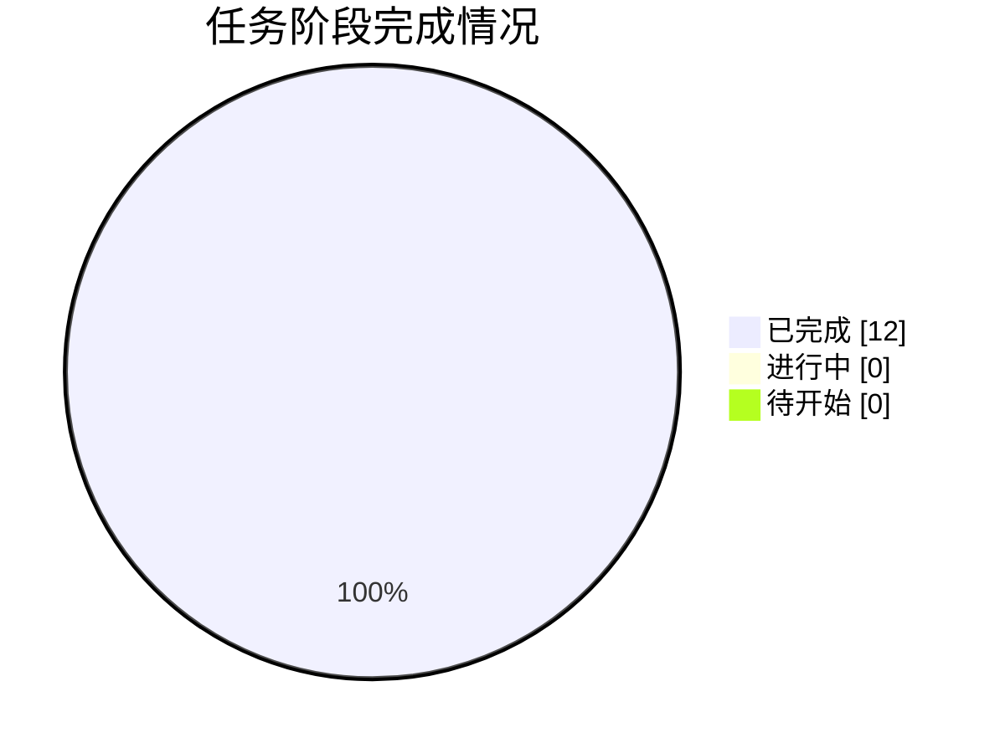

# 📸 同步快照 · 2026-10-04 07:00

> 由 `sync/sync_to_github.py` 自动生成 | 数据源：`agent_workspace/STATE.md`

## 本轮概要

| 指标 | 值 |
|---|---|
| 当前进度 | **100%** |
| 已完成阶段 | 12 |
| 进行中阶段 | 0 |
| 待开始阶段 | 0 |
| 当前阶段 | G6 提交包汇总（全部阶段完成） |

### 本轮镜像的成果文件

- **代码**：10 个文件
- **论文与阶段文档**：7 个文件
- **图表**：11 个文件
- **结果表格**：18 个文件
- **日志与QA**：7 个文件
- **提交结果**：1 个文件

## 阶段状态表

| 阶段 | 内容 | 状态 | 产物 |
|---|---|---|---|
| **G0** | 工作区/数据勘察、台账建立 | ✅ 完成 | STATE.md、00_admin/* |
| **A1** | 题意拆解 | ✅ 完成 | paper/01_题意拆解.md |
| **A2** | 假设清单 | ✅ 完成 | paper/01b_假设清单.md |
| **A3** | 清洗/EDA/特征工程 | ✅ 完成 | code/eda_clean.py、output/eda/*、output/data/clean_*.csv |
| **A4** | Q1 标注规则设计 | ✅ 完成 | paper/02_问题1标注模型.md、output/tables/q1_*.csv|json |
| **A5** | Q2/Q3 算法规格 | ✅ 完成 | paper/03_算法规格.md |
| **A6** | 代码实现与结果产出 | ✅ 完成 | code/{q1_label,q2_reg,q3_clf,fill_result}.py、output/Result_提交.xlsx |
| **A7** | 结果与敏感性分析 | ✅ 完成 | code/q_sensitivity.py、paper/04_结果分析.md、output/tables/q*_sensitivity 等表 |
| **A8** | 可视化 | ✅ 完成 | code/plots.py、output/figures/fig1~fig11.png（300dpi，中文正常） |
| **A9** | 论文撰写 | ✅ 完成 | paper/论文.md（290 行） |
| **A10** | 摘要与全文润色 | ✅ 完成 | 摘要定稿、中英混杂修正 |
| **G6** | 提交包汇总 | ✅ 完成 | paper/论文.docx（106 段/9 表/8 图） |



---

## 附：STATE.md 台账原文

```markdown
# STATE.md — 2025 MathorCup 大数据竞赛 B 赛道 流水线状态台账

> 维护人：A0 chief-orchestrator。每次调度前后更新，保证上下文丢失可恢复。
> 最后更新：全流程完成，**终审通过（qa_report 20/20 PASS）**。

## 1. 赛题与交付要求（摘要）
- 赛题：物流理赔风险识别及服务升级。三类风险标注：合理诉求 / 诉求偏高 / 严重超额。
- 索赔差额 = 实际赔付金额 − 索赔金额（本数据 100% 样本索赔>实赔；超额索赔额 x = 索赔 − 实赔）。
- 软约束：严重超额占比 <3%，合理诉求 ≥85%；阈值随实赔增大（次线性幂律）；层内差额密集性。

## 2. 数据事实（已核验）
- data/附件1.xlsx：真实样本 **11167**（首条数据行为英文字段名行）；含目标列，无运单号。
- data/附件2.xlsx：真实样本 **2792**；运单号 1..2792。
- 数据坑（已处理）：-1 缺失标记；妥投到进线时长毫秒/秒混用（9.55% 样本 ≥1e7，/1000 归一）；配送超时时长 ~427850 哨兵值（65.5%）；万单理赔率负值置缺失；异常原因 NaN 48.6% 归独立类别。
- 训练/测试同分布：8 关键字段 PSI 均 <0.011。

## 3. 关键模型结论（均为实测）
- 【Q1 标注规则】四步法：实赔等频分层→层内密度谷值→幂律阈值曲线→软约束网格选择。
  T1(y)=53.958·y^0.5602（R²=0.972），T2(y)=129.648·y^0.4945（R²=0.997）；(q1,q2)=(0.905,0.985)，平均谷深 0.416。
  附件1 标注：合理诉求 89.34%（9977）/ 诉求偏高 9.31%（1040）/ 严重超额 1.34%（150）。参数 ±10% 扰动一致率 ≥97.9%。
- 【Q2 回归】LightGBM 双参数化集成（log1p(y) + log(c/y) 等权），5 折 CV OOF：SMAPE 0.4324 / MAE 96.04 / RMSE 142.31 / WMAPE 0.3286；基线0 0.4942；XGB 0.4692；3 种子 SMAPE 0.4343±0.0001（单目标口径）。
- 【Q3 分类】路线a（直接分类+反频率类权重 0.37/3.58/24.82+类偏置阈值校正 b_mid=−0.2/b_sev=−0.8+辅助特征 x̂=c−ŷ）OOF macro-F1 **0.6398**（严重超额 F1 0.168）；路线b（Q2 OOF 套规则）0.5806（严重超额 F1 0.012）。按预设准则提交路线a。
- 【Result】output/Result_提交.xlsx：2792 行，运单号 1..2792 原序；金额 min/中位/max=18.02/200.60/1445.90；标注分布 89.97%/9.92%/0.11%，软约束通过。

## 4. 阶段状态（全部完成）
| 阶段 | 内容 | 状态 | 产物 |
|---|---|---|---|
| G0 | 工作区/数据勘察、台账建立 | DONE | STATE.md、00_admin/* |
| A1 | 题意拆解 | DONE | paper/01_题意拆解.md |
| A2 | 假设清单 | DONE | paper/01b_假设清单.md |
| A3 | 清洗/EDA/特征工程 | DONE | code/eda_clean.py、output/eda/*、output/data/clean_*.csv |
| A4 | Q1 标注规则设计 | DONE | paper/02_问题1标注模型.md、output/tables/q1_*.csv|json |
| A5 | Q2/Q3 算法规格 | DONE | paper/03_算法规格.md |
| A6 | 代码实现与结果产出 | DONE | code/{q1_label,q2_reg,q3_clf,fill_result}.py、output/Result_提交.xlsx |
| A7 | 结果与敏感性分析 | DONE | code/q_sensitivity.py、paper/04_结果分析.md、output/tables/q*_sensitivity 等表 |
| A8 | 可视化 | DONE | code/plots.py、output/figures/fig1~fig11.png（300dpi，中文正常） |
| A9 | 论文撰写 | DONE | paper/论文.md（290 行） |
| A10 | 摘要与全文润色 | DONE | 摘要定稿、中英混杂修正 |
| A11 | 终审质检 | DONE **20/20 PASS** | code/qa_check.py、output/logs/qa_report.md |
| G6 | 提交包汇总 | DONE | paper/论文.docx（106 段/9 表/8 图） |

## 5. 提交包清单
1. output/Result_提交.xlsx（= 工作区 data/Result.xlsx，已强校验）
2. paper/论文.md + paper/论文.docx
3. code/ 9 个脚本（common/eda_clean/q1_label/q2_reg/q3_clf/fill_result/q_sensitivity/plots/qa_check + export_docx）+ output/logs/ 运行日志
4. output/ 图表 11 张、表格 20+、中间数据集

## 6. 终审记录（A11）
- 结论：**终审通过**（output/logs/qa_report.md，主会话视觉终检 3 项修复后复检仍 20/20 PASS）。要点：行数 2792、运单号原序、标注三值合法、金额非负无缺失、桌面 C:\Users\21732\Desktop\Result.xlsx 未被改动（仍为空模板）、eda_clean 重跑逐字节一致、OOF SMAPE 复算一致（0.4324）、混淆矩阵行和守恒、论文锚点数字齐全、8 张引用图齐全、两处必答论述存在、提交分布软约束通过。
- **视觉终检 3 项修复完成（2026-10-04，主会话 14 页逐页终检反馈）**：
  1. 符号说明表破损修复——export_docx.py 表格改按"非转义竖线"切分并还原 `\|`；论文.md 中 WMAPE/SMAPE 公式改纯文本（WMAPE = Σ|y−ŷ| / Σ|y|，T_k(y)=a_k·y^(b_k)），单元格不再串列（PDF 第 3 页目检确认）；
  2. 编号续排修复——导出器弃用 Word List Number 样式，编号列表改为手工编号普通段落（悬挂缩进），三/5.1/8.1/九章列表均从 1. 重计（PDF 目检确认）；
  3. fig10 图例 x_hat→x̂——plots.py 改用 mathtext $\hat{x}$，无缺字形（PDF 第 10 页目检确认）。
- 论文_render.pdf 已生成（paper/论文_render.pdf，14 页，Word COM FileFormat=17；已用 pypdf 去除空密码加密；ps1 需 UTF-8 BOM 否则中文路径被 GBK 误读，见决策 D14）。渲染证据：output/logs/qa_page3/10/11/12.png。
- Result_提交.xlsx 与全部数值结论不变，未重跑模型。
- 环境注记：本环境无 Task 子代理工具，A0 按角色分工串行执行 A1–A11，产物均按角色落盘（决策 D01）。docx 由 python-docx 导出。
- 纪律提醒：全部代码与论文为原创，参考仓库仅作思路/格式参照未复制；论文附录 C 已预置 AI 使用声明模板，**请人类队长按 MathorCup 章程申报 AI 使用后提交**。

## 7. 恢复指引
先读本文件 → 00_admin/decisions.md → paper/01~04。重跑顺序：eda_clean.py → q1_label.py → q2_reg.py → q3_clf.py → fill_result.py → q_sensitivity.py → plots.py → qa_check.py（`python code/xxx.py`，绝对路径，任意工作目录）。种子固定（2025），可复现。

```

## 附：任务看板原文

```markdown
# 任务看板 task_board.md（A0 维护）

## 看板
| 任务卡 | 负责 | 输入 | 输出 | 门禁 | 状态 |
|---|---|---|---|---|---|
| T-A1 题意拆解 | A1 | 赛题要点、数据勘察 | paper/01_题意拆解.md | G1: 三问拆解完整、口径定义清晰 | DONE |
| T-A2 假设清单 | A2 | 赛题+EDA 线索 | paper/01b_假设清单.md | 假设可检验、不超过 8 条 | DONE |
| T-A3 数据工程 | A3 | data/附件1.xlsx、附件2.xlsx | code/eda_clean.py、output/eda/*、output/data/clean_*.csv | G2: 缺失/异常全说明、清洗后可复跑 | DONE |
| T-A4 Q1 规则设计 | A4 | A3 产物 | paper/02_问题1标注模型.md、output/tables/q1_*.csv | G3: 满足软约束、规则可复现 | DONE |
| T-A5 算法规格 | A5 | A3/A4 产物 | paper/03_算法规格.md | 指标/CV/不均衡方案完整 | DONE |
| T-A6 代码实现 | A6 | A3–A5 产物 | code/*.py、output/tables/*、output/Result_提交.xlsx | G4: 运单号不变、类别取值合法、日志齐全 | DONE |
| T-A7 结果分析 | A7 | A6 产物 | paper/04_结果分析.md | 含敏感性+两路线对比数据 | DONE |
| T-A8 可视化 | A8 | A3/A4/A6 产物 | output/figures/fig*.png | 中文无乱码、300dpi | DONE |
| T-A9 论文撰写 | A9 | 全部产物 | paper/论文.md | G5: 结构完整、含两处必答论述 | DONE |
| T-A10 润色 | A10 | 论文.md | 摘要定稿版 | 格式统一 | DONE |
| T-A11 终审质检 | A11 | 全部 | code/qa_check.py、output/logs/qa_report.md | G6: 0 ERROR 才终审通过 | DONE |

## 任务卡索引
- 00_admin/task_cards/ 下按 T-A1 ... T-A11 存卡（卡内含输入/输出/验收标准）。

## 冲突与仲裁记录
- 暂无冲突。全流程串行执行（D01），A11 终审 20/20 PASS，无打回事项。

```

## 附：决策记录原文

```markdown
# 决策记录 decisions.md（A0 维护）

| # | 阶段 | 决策 | 理由 | 影响 |
|---|---|---|---|---|
| D01 | G0 | 本环境无 Task 子代理工具，A0 串行执行 A1–A11 全部角色工作，产物按角色落盘，各阶段设门禁自检 | 工具面限制；保证流水线可恢复、可审计 | 全流程 |
| D02 | G0 | 不改动用户桌面 C:\Users\21732\Desktop\Result.xlsx 原文件；结果只写入工作区 data/Result.xlsx 副本与 output/Result_提交.xlsx | 任务书"不要动用户桌面原文件" | A6 |
| D03 | G0 | docx 导出采用 python-docx（pandoc 不可用，已 pip 安装 python-docx 1.2.0） | 环境约束 | A9/A10 |
| D04 | A3 | 量纲异常处理：妥投到进线时长/配送超时时长按单位归一（>4×10^6 判定为毫秒制，/1000）后做 1%/99% 分位截尾；-1 与负值按缺失处理，万单理赔率负值置 NaN 后用中位数/模型原生缺失处理 | EDA 实测分布 | A3/A6 |
| D05 | A4 | Q1 规则采用"相对超额率 r=(索赔−实赔)/实赔 双阈值 + 实赔分位分层密度谷值校验"，而非纯绝对差额阈值 | 满足"实赔越高阈值越大"与层内密集性两条线索，且参数少、可解释 | Q1/Q3 |
| D06 | A5 | Q2 主模型 LightGBM（log1p 目标，类别特征原生，5 折 CV）；Q3 对比路线a直接分类与路线b先回归后标注，OOF 实证后定主路线 | 竞赛常规最优+赛题要求论述两路线 | Q2/Q3 |
| D07 | A6 | 类别特征（城市/ID/网点类）一律用原生 category 或频次编码，禁止全局目标编码，防泄漏 | 学术诚信与稳健性 | A6 |
| D08 | A6 | Result 风险标注取值严格为 {合理诉求, 诉求偏高, 严重超额} 中文三值；填写前校验运单号序列 | 赛题硬约束 | A6/A11 |
| D09 | A9 | 参考仓库仅借鉴思路与图表组织方式，所有文字代码重写为原创，论文中不引用其原文 | 查重与学术诚信 | A9 |
| D10 | A11 | 终审只读核查项：代码可复跑、数字一致、运单号不变、占比软约束、图表引用完整；任一 ERROR 打回修复复检 | 任务书交付标准 | G6 |
| D11 | A6 | Q2 最终方案为 LightGBM 双参数化集成（log1p(y) 与 log(c/y) 等权融合），XGBoost 降为对比项 | 调参实验：集成 OOF SMAPE 0.4324 优于单目标 0.4341/0.4353 | Q2 |
| D12 | A6 | Q3 最终采用路线a（直接分类）+ 回归辅助特征 x̂=c−ŷ（训练用 OOF 防泄漏）；路线b（先回归后标注）因 macro-F1 低 5.9pp 且严重超额 F1=0.012 不采用，仅在论文中作对比论述 | OOF 实证 + 论文预设选择准则（差距<0.02 才取路线b） | Q3 |
| D13 | A6 | 阈值校正以 macro-F1 最大为目标、预测分布偏离先验≤2pp 为过滤条件；最终 b_mid=−0.2, b_sev=−0.8 | q3_threshold_search.csv 全表实证 | Q3 |
| D14 | 视觉终检 | 3 项渲染修复：①导出器表格按未转义竖线切分并还原 `\|`，md 中表格内公式用 `\|` 转义、正文用原色 \|；②编号列表弃用 Word List Number 改手工编号段落（修跨章续排）；③fig10 图例用 mathtext $\hat{x}$ 渲染 x̂。另：PowerShell .ps1 含中文路径必须 UTF-8 BOM；Word COM 导出的 PDF 带空密码加密，交付前用 pypdf 解密重写 | 主会话 14 页逐页终检反馈；PDF 第 3/10/11 页目检复核 | 论文交付件 |

（随阶段推进追加）

```
